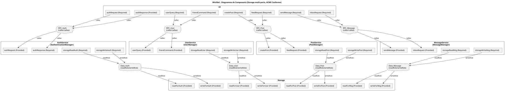
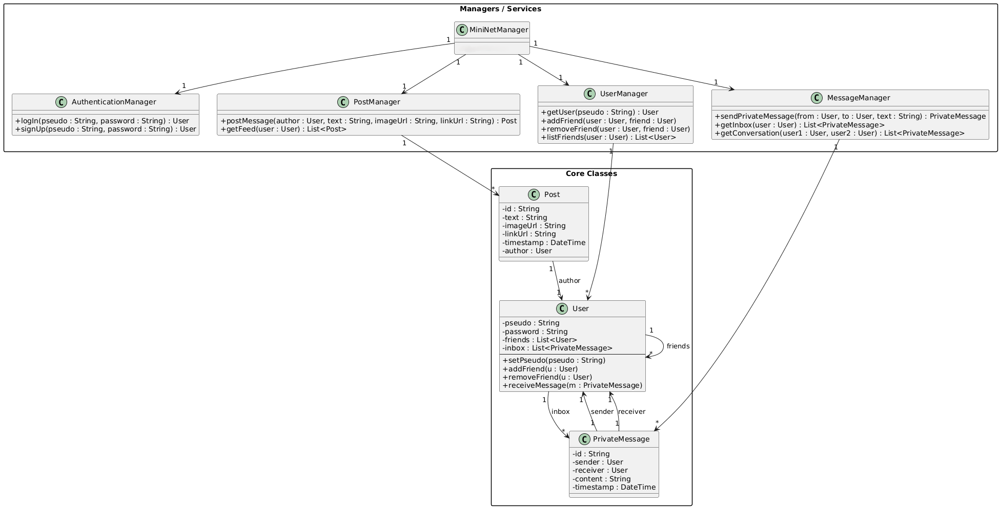

# MiniNet – Document d’architecture

## 1. Contexte et objectifs

MiniNet est un mini réseau social développé dans un cadre pédagogique (architecture logicielle). L’objectif principal du projet est de concevoir et justifier une **architecture logicielle claire, modulaire et cohérente**.

Le système permet aux utilisateurs de :
- créer un compte et s’authentifier ;
- gérer des relations d’amitié ;
- publier des messages (posts) visibles dans un fil d’actualité ;
- échanger des messages privés.

Le projet met l’accent sur :
- la séparation des responsabilités ;
- la cohérence entre conception (ACME, UML) et implémentation Python ;
- l’explicitation des flux de données et des interactions entre composants.

---

## 2. Exigences

### 2.1 Exigences fonctionnelles

- EF1 : Inscription et authentification des utilisateurs.
- EF2 : Consultation et gestion du profil utilisateur.
- EF3 : Ajout et consultation de la liste d’amis.
- EF4 : Publication de posts textuels.
- EF5 : Publication de posts avec images (optionnel).
- EF6 : Consultation d’un fil d’actualité.
- EF7 : Envoi et réception de messages privés.
- EF8 : Accès via une interface utilisateur (CLI ou Web).

### 2.2 Exigences non fonctionnelles

- ENF1 : Architecture modulaire et extensible.
- ENF2 : Séparation claire entre interface, logique métier et stockage.
- ENF3 : Lisibilité et maintenabilité du code.
- ENF4 : Possibilité de faire évoluer le stockage (mémoire → base de données).
- ENF5 : Cohérence stricte entre architecture conceptuelle et implémentation.

---

## 3. Vue d’ensemble de l’architecture

MiniNet adopte une architecture **Component & Connector (C&C)**, formalisée en ACME et illustrée par des diagrammes UML de composants.

L’architecture repose sur :
- un composant **UI** (interface utilisateur) ;
- plusieurs **services métier spécialisés** ;
- un composant **Storage** centralisant l’accès aux données ;
- des **connecteurs explicites** pour les appels de service et l’accès aux données.

Cette organisation favorise un faible couplage et une forte cohésion.

---

## 4. Description des composants

### 4.1 UI (Interface Utilisateur)

**Responsabilité** : interaction avec l’utilisateur.

- Fournit : affichage des informations (feed, messages, amis).
- Requiert : authentification, gestion des utilisateurs, posts et messages.

L’UI peut être implémentée sous forme :
- d’interface en ligne de commande ;
- d’interface web minimale (Flask).

L’UI ne contient aucune logique métier.

Dans un premier temps, l'UI proposée était une interface en ligne de commande simple. Cependant, pour enrichir l'expérience utilisateur et mieux répondre aux exigences fonctionnelles, une interface web minimale utilisant Flask a été développée. 
Cette interface web permet une interaction plus intuitive avec les fonctionnalités de MiniNet, tout en respectant la séparation claire entre l'interface utilisateur et la logique métier.

---

### 4.2 AuthService (AuthenticationManager)

**Responsabilité** : gestion de l’authentification.

Fonctionnalités :
- inscription des utilisateurs ;
- connexion (login) ;
- vérification des identifiants.

Dépendances :
- accès en lecture/écriture au stockage pour gérer les comptes.

---

### 4.3 UserService (UserManager)

**Responsabilité** : gestion des relations sociales.

Fonctionnalités :
- récupération des informations utilisateur ;
- ajout et consultation des amis.

Ce service ne gère ni les posts ni les messages.

---

### 4.4 PostService (PostManager)

**Responsabilité** : gestion des publications.

Fonctionnalités :
- création de posts ;
- génération du fil d’actualité.

Le feed est calculé à partir des posts de l’utilisateur et de ses amis.

---

### 4.5 MessageService (MessageManager)

**Responsabilité** : gestion des messages privés.

Fonctionnalités :
- envoi de messages ;
- consultation de la boîte de réception.
- consultation de la boîte d’envoi.

---

### 4.6 Storage

**Responsabilité** : persistance des données.

Le stockage est abstrait par des ports multiples :
- ports de lecture et d’écriture spécifiques à chaque service ;
- séparation explicite des flux read/write.

Dans l’implémentation actuelle, le stockage est en mémoire, mais l’architecture permet un remplacement futur par une base de données.

---

## 5. Description des connecteurs

### 5.1 Connecteur RPC

**Type** : appel distant logique.

- Rôles : `caller`, `callee`.
- Utilisé pour : communication UI → Services.

Ce connecteur modélise un appel synchrone entre composants.

---

### 5.2 Connecteur DataAccess

**Type** : accès aux données.

- Rôles : `readRole`, `writeRole`.
- Utilisé pour : communication Services → Storage.

Les rôles décrivent le **sens du flux de données**, indépendamment des opérations métier (lecture/écriture logique).

---

## 6. Diagrammes d’architecture

### 6.1 Diagramme de composants UML

Le diagramme UML illustre :
- les composants principaux ;
- leurs ports (Provided / Required) ;
- les connecteurs RPC et DataAccess.

Il permet une lecture intuitive de l’architecture.



---

### 6.2 Diagramme ACME

Le diagramme ACME formalise l’architecture de manière rigoureuse :
- définition de la famille d’architecture ;
- typage explicite des composants et connecteurs ;
- attachements détaillés entre ports et rôles.

ACME garantit la cohérence conceptuelle de l’architecture.

refererer à : [conception/archi.acme](conception/archi.acme)

---

### 6.3 Diagramme de classes UML

Le diagramme de classes UML détaille la structure interne des composants :
- classes principales ;
- attributs et méthodes ;
- relations entre classes.
- Il illustre la correspondance entre architecture et implémentation.




---

## 7. Traçabilité entre architecture et implémentation Python

Cette section établit un lien explicite entre l’architecture définie (ACME et UML) et son implémentation concrète en Python. Elle permet de démontrer que l’architecture n’est pas seulement conceptuelle, mais effectivement respectée dans le code.

### 7.1 Correspondance composants ↔ modules Python

Chaque composant architectural est implémenté sous la forme d’un module ou d’une classe Python dédiée :

- **UI** : implémentée par l’application web Flask (`web/app.py`).
- **AuthService** : implémenté par la classe `AuthenticationManager`.
- **UserService** : implémenté par la classe `UserManager`.
- **PostService** : implémenté par la classe `PostManager`.
- **MessageService** : implémenté par la classe `MessageManager`.
- **Storage** : implémenté par une classe de stockage en mémoire (ex. `MemoryStorage`).

Chaque manager encapsule exclusivement la logique métier correspondant à son composant architectural.

---

### 7.2 Correspondance ports ↔ méthodes

Les ports définis dans les diagrammes correspondent directement aux méthodes exposées par les managers :

- Les ports **Provided** sont implémentés par des méthodes publiques (ex. `signUp`, `logIn`, `postMessage`, `getFeed`).
- Les ports **Required** correspondent à des dépendances internes, injectées via le `MiniNetManager`.

Ainsi, un appel de port dans l’architecture correspond à un appel de méthode dans l’implémentation.

---

### 7.3 Implémentation des connecteurs

Les connecteurs ne sont pas implémentés explicitement comme des objets Python, mais sont matérialisés par :

- des appels de méthodes directs pour les connecteurs **RPC** (UI → Services) ;
- des appels internes au stockage pour les connecteurs **DataAccess** (Services → Storage).

Ce choix est cohérent avec une implémentation monolithique locale, tout en conservant une séparation conceptuelle claire.

---

### 7.4 Gestion des dépendances et absence de cycles

L’architecture impose une dépendance unidirectionnelle :

```
UI → Services → Storage
```

Cette règle est strictement respectée dans le code Python, ce qui permet :
- d’éviter les dépendances circulaires ;
- de faciliter les tests unitaires ;
- de garantir une bonne maintenabilité.

---

## 8. Justification des choix architecturaux

### 8.1 Architecture orientée services

Chaque service a une responsabilité unique :
- meilleure lisibilité ;
- facilité de maintenance ;
- évolutivité accrue.

---

### 8.2 Séparation UI / Métier / Données

- l’UI est indépendante de la logique métier ;
- les services encapsulent les règles métier ;
- le stockage est abstrait.

Cette séparation respecte les principes de bonne architecture logicielle.

---

### 8.3 Ports multiples pour Storage

Le choix de ports distincts (`readForX`, `writeForX`) permet :
- une compréhension immédiate des flux ;
- la gestion de lectures concurrentes ;
- une meilleure scalabilité conceptuelle.

---

### 8.4 Utilisation d’ACME

ACME permet :
- une spécification formelle de l’architecture ;
- une justification académique des choix ;
- une traçabilité entre conception et implémentation.

---

## 9. Conclusion

Le projet MiniNet propose une architecture claire, cohérente et extensible, adaptée à un réseau social simplifié.

La cohérence entre :
- exigences ;
- diagrammes UML ;
- spécification ACME ;
- implémentation Python